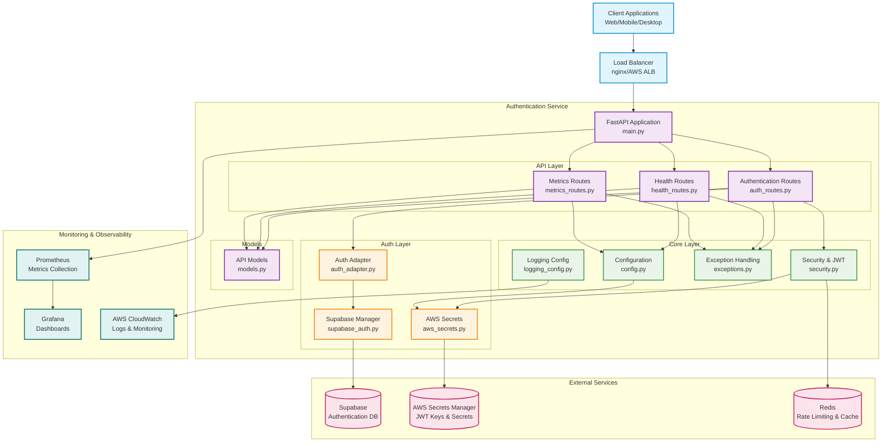
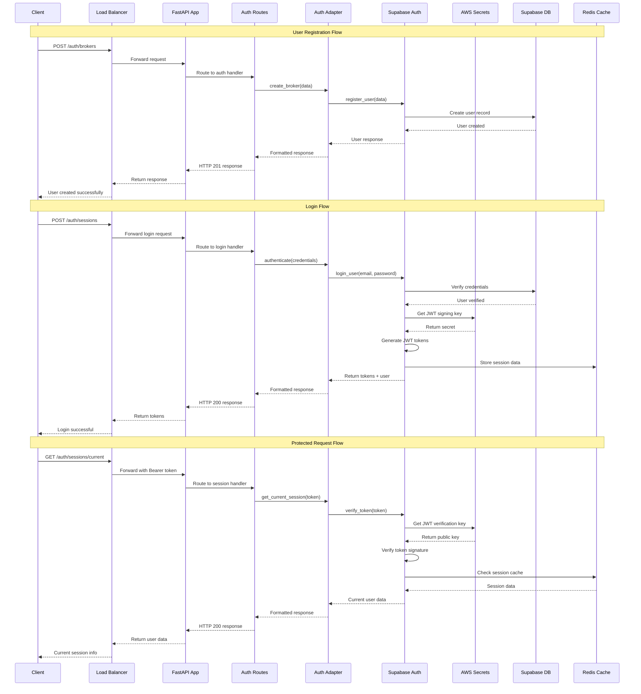
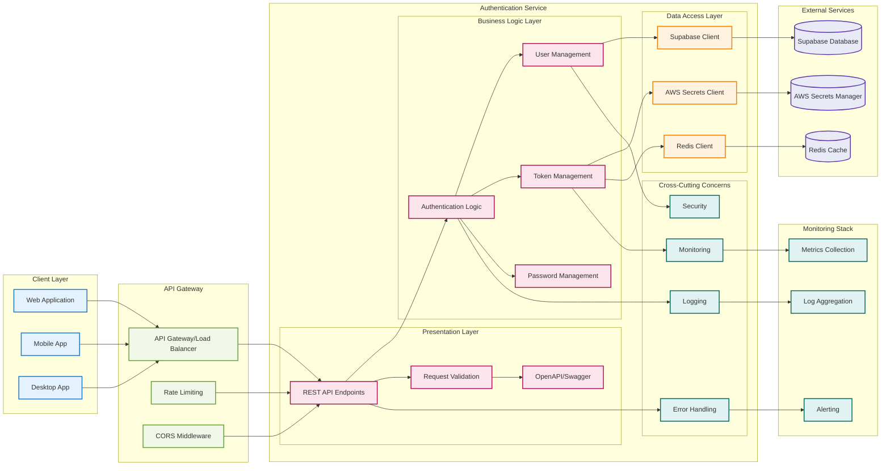
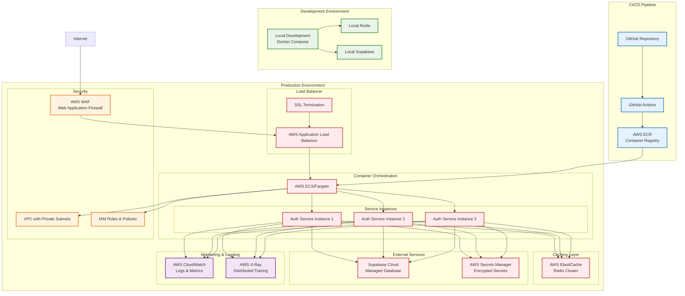
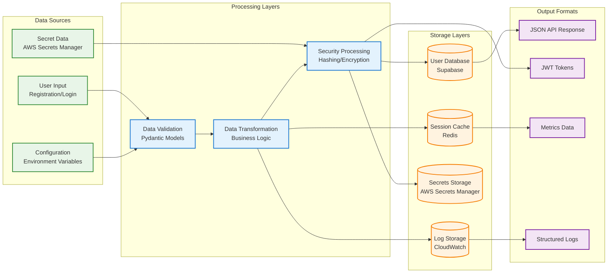
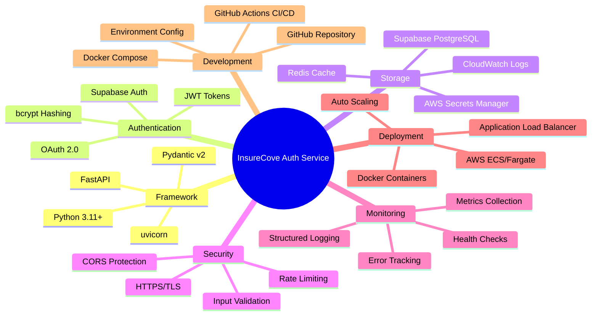

# 🏛️ InsureCove Authentication Service - Architecture Diagram

## 🎯 **System Architecture Overview**

---

## 🔄 **Request Flow Diagram**

---

## 🏗️ **Component Architecture**

---

## 🚀 **Deployment Architecture**

---

## 📊 **Data Flow Architecture**

---

## 🔧 **Technical Stack Overview**

---

## 🎯 **Key Architectural Decisions**

### **1. Layered Architecture**
- **Presentation Layer**: FastAPI routes and API models
- **Business Logic Layer**: Authentication and user management
- **Data Access Layer**: Supabase and AWS integrations
- **Cross-Cutting Concerns**: Logging, monitoring, security

### **2. External Service Integration**
- **Supabase**: Primary authentication and user data storage
- **AWS Secrets Manager**: Secure secret and JWT key management
- **Redis**: Session caching and rate limiting

### **3. Security-First Design**
- JWT tokens with RS256 signing
- Secure secret management (no hardcoded secrets)
- Rate limiting and CORS protection
- Input validation and sanitization

### **4. Observability**
- Structured logging with correlation IDs
- Health checks for all dependencies
- Comprehensive metrics collection
- Error tracking and alerting

### **5. Scalability**
- Stateless service design
- Horizontal scaling capability
- Load balancer distribution
- Cache-first data access patterns

---

**Last Updated**: January 15, 2024  
**Architecture Version**: 1.0.0
